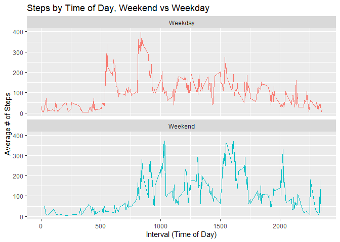

---
title: "Reproducible Research: Peer Assessment 1"
output: 
  html_document:
    keep_md: true
---


## Loading and preprocessing the data

```r
# library("knitr")
library("data.table")
library("ggplot2")
# library("scales")
#Load the data
activity <- read.csv("activity.csv", header=TRUE)
#Process/transform the data, remove NA's
uglyData  <- data.table(activity)
data    <- uglyData
data    <- data[which(data$steps!=0),]
```

## What is mean total number of steps taken per day?

```r
#Calculate the total number of steps per day
dayTotals <-  aggregate(steps ~ date, data, sum)
nDays     <-  difftime(tail(data$date, n=1), head(data$date, n=1))
toString(as.integer(nDays)) #58 days
```

```
## [1] "58"
```

```r
#histogram of total number of steps taken per day
hist(dayTotals$steps,main="Total Daily Steps",xlab="Number of Steps",breaks=48)
#calculate mean and meadian of total number of steps taken per day
meanSteps   <-  mean(dayTotals$steps)     #10766
medianSteps <-  median(dayTotals$steps)   #10765
print<-as.data.frame(list(as.integer(meanSteps),as.integer(medianSteps)))
colnames(print)<-list("|Mean # of steps|","|Median # of steps|")
print
```

```
##   |Mean # of steps| |Median # of steps|
## 1             10766               10765
```

```r
abline(v=meanSteps,col='red')
abline(v=medianSteps,col='blue')
```

<!-- -->

## What is the average daily activity pattern?

```r
intervalMeans <-  data[, c(lapply(.SD, mean, na.rm = TRUE)), .SDcols = c("steps"), by = .(interval)] 
intervalMeans <-  intervalMeans[order(interval)]
#line plot of Steps by Time of Day
plot(intervalMeans$interval,intervalMeans$steps,type='l',main="Steps by Time of Day",
    xlab="Interval (Time of Day)",ylab="Average # of Steps")
#max steps in an avg interval
intervalMeans <-  intervalMeans[order(steps)]
tail(intervalMeans,n=1) #835
```

```
##    interval    steps
## 1:      835 352.4839
```

```r
abline(v=835,col='blue')
```

<!-- -->

## Imputing missing values

```r
#calculate and report the total number of missing values in the dataset (i.e. the total number of rows with NAs)
NAdata  <- uglyData
NAdata  <- NAdata[which(is.na(NAdata$steps)),]
nrow(NAdata[is.na(steps),]) #2304
```

```
## [1] 2304
```

```r
#filling in all of the missing values in the dataset
NAdat <-NAdata[,2:3]
NAdat <- merge(intervalMeans,NAdat)
#Create a new dataset that is equal to the original dataset but with the missing data filled in.
AproxData <- rbind(NAdat, data)
nDays     <-  difftime(tail(AproxData$date, n=1), head(AproxData$date, n=1))
toString(as.integer(nDays)) #59 days
```

```
## [1] "59"
```

```r
#histogram of total number of steps taken per day
dayTotals <-  aggregate(steps ~ date, AproxData, sum)
hist(dayTotals$steps,main="Total Daily Steps",xlab="Number of Steps",breaks=48)
#Mean and meadian of total #s of steps per day
oldMean     <-  meanSteps               #10766
meanSteps   <-  mean(dayTotals$steps)   #13162
medianSteps <-  median(dayTotals$steps) #11458
#Filling in the NA Data has skewed the results
print<-as.data.frame(list(as.integer(oldMean),as.integer(meanSteps),as.integer(medianSteps)))
colnames(print)<-list("|Old Mean|","|Mean # of steps|","|Median # of steps|")
print
```

```
##   |Old Mean| |Mean # of steps| |Median # of steps|
## 1      10766             13162               11458
```

```r
abline(v=meanSteps,col='red')
abline(v=medianSteps,col='blue')
abline(v=oldMean,col='grey')
```

<!-- -->


## Are there differences in activity patterns between weekdays and weekends?

```r
data    <- uglyData
data    <- data[which(data$steps!=0),]
#Create a new factor variable in the dataset with two levels – “weekday” and “weekend” indicating whether a given date is a weekday or weekend day.
data[, date := as.POSIXct(date, format = "%Y-%m-%d")]
data[, `DoW`:= weekdays(x = date)]
data[grepl(pattern = "Monday|Tuesday|Wednesday|Thursday|Friday", x = `DoW`), "dayOrEnd"] <- "Weekday"
data[grepl(pattern = "Saturday|Sunday", x = `DoW`), "dayOrEnd"] <- "Weekend"
#Time series line plot of the 5-minute interval (x-axis) and the average number of steps taken
#Averaged across all weekday days or weekend days (y-axis)
intervalMeans<-data[, c(lapply(.SD, mean, na.rm = TRUE)), .SDcols = c("steps"), by = .(interval, `dayOrEnd`)] 
ggplot(intervalMeans , aes(x = interval , y = steps, color=`dayOrEnd`)) + geom_line() +
  labs(title = "Steps by Time of Day, Weekend vs Weekday", x = "Interval (Time of Day)", y = "Average # of Steps") +
  facet_wrap(~`dayOrEnd` , ncol = 1, nrow=2) +
  theme(legend.position="none")
```

<!-- -->
